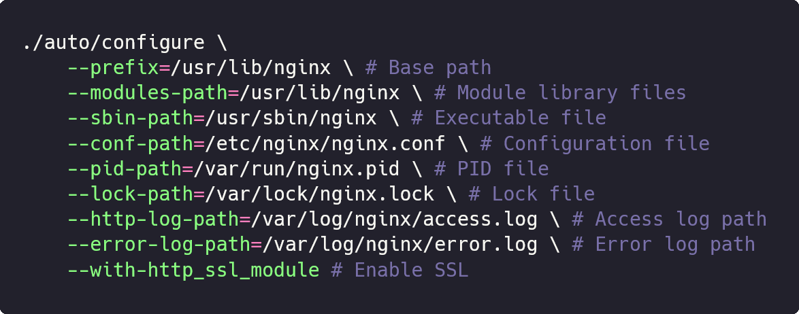
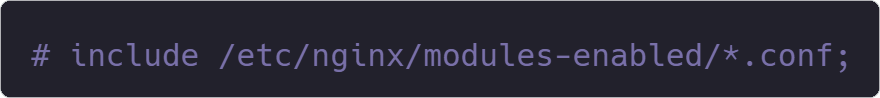
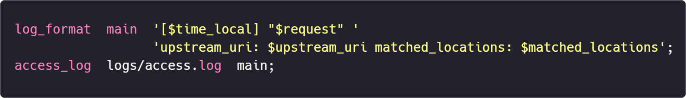

<div align="center">
  <div>
  <a href="README.md">中文文档</a> <span style="margin: 0 14px">|</span> English Documentation
  </div>
  <br>
  
</div>
<br>
> <b>Dedicated to creating the most convenient, efficient, and versatile Nginx debugger</b>

## Table of Contents

- [The Origin of NGINX Debugger](#the-origin-of-nginx-debugger)
- [Technical Details](#technical-details)
- [How to Use](#how-to-use)
  - [Windows](#windows)
  - [Linux](#linux)
  - [FAQ](#faq)
- [Reference Configuration](#reference-configuration)
- [Comparison with Other Tools](#comparison-with-other-tools)
  - [Fiddler](#fiddler)
  - [Wireshark](#wireshark)
  - [error.log](#errorlog)
  - [Summary](#summary)
- [License](#license)

## The Origin of NGINX Debugger

As a front-end engineer, dealing with NGINX is part of my daily routine. NGINX is powerful and offers flexible configurations, but it's challenging for beginners to master, especially when it involves configurations related to location:

- Firstly, `location` supports multiple matching methods, such as <b>prefix matching</b>, <b>exact matching</b> and <b>regex matching</b>. Different matching methods have <b>different priorities</b>, which can easily cause confusion and lead to configuration errors.

- Secondly, `location` can be paired with other directives like <i>rewrite</i>, <i>try_files</i>, <i>proxy_pass</i>, etc. These can make NGINX exhibit different behaviors: for example, <i>rewrite</i> can modify the URL, causing the request to internally redirect within NGINX and match other rules; <i>try_files</i> has a similar effect; while <i>proxy_pass</i> can modify the request's <i>upstream</i>, forwarding it to the next endpoint.

I have consulted various resources hoping to find a good solution, but to no avail 😞. So, I decided to develop a tool myself to help me efficiently solve all the above problems — <b>NGINX Debugger</b> was born 🥳

## Technical Details

NGINX Debugger is a recreation based on NGINX's latest version 🏷️[1.27.2](https://github.com/nginx/nginx/commit/e24f7ccc161f1a2a759eb27263ec9af4fc7c8e96): it adds an array property `ngx_array_t *matched_locations` to the `ngx_http_request_s` structure to store the process of NGINX matching location; it also registers two variables in `ngx_http_upstream.c` — upstream_uri and matched_locations, allowing us to obtain NGINX's <i>complete upstream address</i> and the <i>complete matching process of location</i> in <i>access.log</i> via `$upstream_uri` and `$matched_locations`. <b>Besides that, the code hasn't been changed at all, and the overall framework remains the same. </b>Therefore, you don't have to worry about any changes in NGINX's working mode, nor about the authenticity and accuracy of the variable values, because they are just simple concatenations and mappings of NGINX's internal variables.

## How to Use

This release of NGINX Debugger is compiled into two versions, one for <b>Windows</b> and one for <b>Linux</b>.

### Windows

The file system structure of Windows is simpler compared to Linux. You only need to copy the <i>nginx.exe</i> file from the repository into your local NGINX folder, replacing the previous executable file.

### Linux

When compiling the Linux version of NGINX, you need to specify directories for various options (such as --modules-path, --sbin-path, --conf-path, etc.). Taking the most popular Linux distribution at the moment — Ubuntu — as a reference, based on its Nginx installation directory, I used the following command to compile Nginx Debugger:



Although there are many Linux distributions, their Nginx installation directory structures are basically the same. You only need to copy the nginx file from the repository to replace `/usr/sbin/nginx`.

- #### FAQ

  If, when starting NGINX Debugger, you find console errors similar to the following reminding of <b>module version mismatch</b>:

  ```bash
  nginx: [emerg] module "/usr/lib/nginx/modules/ngx_http_geoip2_module.so" version 1018000 instead of 1027003 in /etc/nginx/modules-enabled/50-mod-http-geoip2.conf:1
  ```

  This is because NGINX Debugger is compiled based on the latest version 🏷️[1.27.2](https://github.com/nginx/nginx/commit/e24f7ccc161f1a2a759eb27263ec9af4fc7c8e96), and the Nginx installed on your local machine may be older, resulting in module mismatches. You only need to comment out the statements in nginx.conf that include `modules-enabled` (if you don't need these modules).

  

## Reference Configuration

You can refer to the following configuration to enable support for upstream_uri and matched_locations in access.log (for reference only; you can configure as needed):



## Comparison with Other Tools

### Fiddler

> <small>Debugging and Troubleshooting Made Simple</small>

- Advantages: Fiddler is a powerful network debugging proxy tool, mainly used to capture, analyze, and debug HTTP and HTTPS network requests. It has a user-friendly interface and is easy to get started with, making it the first network debugging tool that most people encounter.
- Disadvantages: <b>It cannot capture requests forwarded by NGINX acting as a proxy.</b> Therefore, you cannot see where NGINX has forwarded your request or what the specific request path is. Another minor inconvenience is that every time you want to debug, you have to reopen Fiddler and filter out the data you want from a large number of HTTP and HTTPS requests it captures (unless you configure Filters).

### Wireshark

> The world's most popular network protocol analyzer

- Advantages: Wireshark is a network protocol analysis tool that operates at the lowest levels. It can capture and analyze all data from the link layer to the application layer and supports almost all network protocols.
- Disadvantages: Its powerful features mean it's challenging to master. Compared to Fiddler, Wireshark has a much steeper learning curve, and many beginners don't even know how to start capturing requests 😂. Additionally, because it supports almost all protocols (including HTTP, FTP, SMTP, etc.), you have to sift through even more data to find what you need, making the task significantly harder! <b>Most importantly, for HTTPS requests forwarded by NGINX, you cannot find them in Wireshark</b> (because HTTPS encrypts the traffic, and Wireshark doesn't use a man-in-the-middle proxy technique like Fiddler, so it cannot view the encrypted content).

### error.log

> NGINX's official error log

- Advantages: Built-in and can display a lot of debugging information.
- Disadvantages: Under normal circumstances, it only displays critical errors. If you need more information, you have to explicitly enable the `debug` option in the configuration file and restart NGINX. <b>For a specific request, its debugging information spans multiple lines,</b> interleaved with unrelated information; you need to carefully identify and correlate them. <b>There's no clear separation between requests,</b> making it easy to confuse information from one request with another 😒. Lastly, even if you enable the debug option, <b>you still cannot find out where NGINX has forwarded the request or what the complete path is from the log file</b>, because NGINX doesn't record this information.

### Summary

| Debugging Tool | Supports Viewing Upstream        | Supports Viewing location Matching Process | Simple and Efficient |
| -------------- | -------------------------------- | ------------------------------------------ | -------------------- |
| NGINX Debugger | Yes                              | Yes                                        | ⭐⭐⭐⭐⭐           |
| Fiddler        | Not for NGINX-forwarded requests | No                                         | ⭐⭐⭐☆☆             |
| Wireshark      | Supports HTTP, not HTTPS         | No                                         | ⭐⭐⭐☆☆             |
| error.log      | No                               | Yes                                        | ⭐⭐⭐☆☆             |

<b>NGINX Debugger was born to solve these problems!</b> If you've been troubled by NGINX configurations like I have, give this tool a try; it might open up a whole new perspective for you!

## License

[2-clause BSD-like license](LICENSE.txt)
