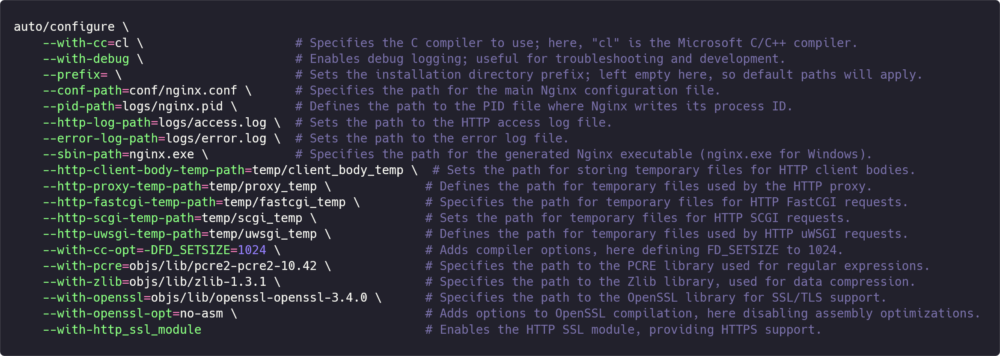
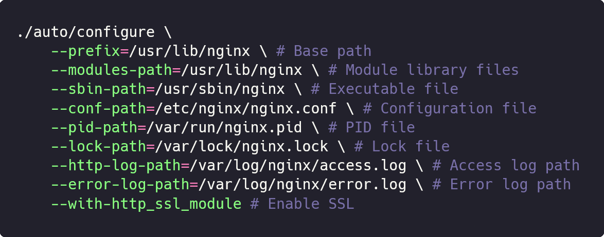

<div align="center">
  <div>
  <a href="README.md">中文文档</a>&emsp;|&emsp;English Documentation
  </div>
  <br>
  <br>
  
<br>

# Dedicated to creating the most convenient, efficient, and versatile Nginx debugger

</div>
<br>

## Table of Contents

- [The Origin of NGINX Debugger](#the-origin-of-nginx-debugger)
- [Problems Solved by NGINX Debugger](#problems-solved-by-nginx-debugger)
- [How to Use](#how-to-use)
  - [Windows](#windows)
  - [Linux](#linux)
    - [FAQ](#faq)
  - [Docker](#docker)
- [Reference Configuration](#reference-configuration)
- [Technical Details](#technical-details)
- [Comparison with Other Tools](#comparison-with-other-tools)
  - [Fiddler](#fiddler)
  - [Wireshark](#wireshark)
  - [error.log](#errorlog)
  - [Summary](#summary)
- [License](#license)

## The Origin of NGINX Debugger

As a front-end engineer, dealing with NGINX is part of my daily routine. But the more I work with NGINX, the more I feel that writing NGINX configuration files is a <b>time-consuming</b> and <b>extremely error-prone</b> task (︶︹︶). Although NGINX is powerful, its configuration directives are <b>numerous</b> and <b>complex</b>, and even a small change can bring about drastic differences. Therefore, we must be extremely cautious when writing NGINX configuration files! Among the many NGINX configuration options, the configuration of the `location` block is a nightmare within a nightmare for me 😭:

- Firstly, `location` supports multiple matching methods, such as <b>prefix matching</b>, <b>exact matching</b> and <b>regex matching</b>. Different matching methods have <b>different priorities</b>, which can easily cause confusion and lead to configuration errors.

- Secondly, within the `location`, you can use other directives like <b>rewrite</b>, <b>try_files</b>, <b>proxy_pass</b>, etc. These can make NGINX exhibit different behaviors: for example, <i>rewrite</i> can modify the URL, causing the request to internally redirect within NGINX and match other rules; <i>try_files</i> has a similar effect; while <i>proxy_pass</i> can modify the request's upstream, forwarding it to another endpoint.

Under such circumstances, when debugging NGINX configurations, we may encounter some <b>"inexplicable bugs"</b> — for example, we clearly expect a request to hit `locationA`, but it behaves as if it hit `locationB`; or we hope that after a request is forwarded, the complete path is `hostname:port/aaa/bbb/ccc`, but in fact, it is forwarded as `hostname:port/bbb/ccc`.

These annoying "bugs" are actually because the request may be internally redirected within NGINX. When the request initially hits `locationA`, due to the presence of the `rewrite` directive in `locationA`, the rewritten request happens to match `locationB`. Additionally, NGINX uses Perl's regular expression engine for matching `location`, which many people are not familiar with. Furthermore, when the `proxy_pass` directive forwards the request to the upstream, the way it concatenates the upstream URI varies in many cases, and the paths concatenated under different circumstances are completely different. Therefore, debugging these issues is quite troublesome and may sometimes take up most of the day 😞.

I have consulted various resources hoping to find a good solution, but to no avail 😞. So, I decided to develop a tool myself to help me efficiently solve all the above problems — <b>NGINX Debugger</b> came into being 🥳

## Problems Solved by NGINX Debugger

NGINX Debugger attempts to solve all the above problems in the simplest and most efficient way, adhering to best practices. After much thought, I decided to register two new variables in <b>access.log</b>: <b>$upstream_uri</b> and <b>$matched_locations</b>. They have the following purposes:

- <b>$upstream_uri</b>: NGINX supports multiple upstreams, including `proxy_pass`, `fastcgi_pass`, `uwsgi_pass`, and `scgi_pass`, etc. No matter which upstream you use, `$upstream_uri` can display the final complete address that NGINX has concatenated.

- <b>$matched_locations</b>: If the `location` block uses the `rewrite` directive, the request may be internally redirected within NGINX, and redirected multiple times. Using `$matched_locations` can display this process in a visual form like `locationA -> locationB -> locationC`, so we can clearly grasp the flow of each request within NGINX, thereby eliminating strange bugs like "it should have hit locationA, but it hit locationB".

## How to Use

NGINX Debugger can be used in three environments: Windows, Linux, and Docker.

### Windows

Below are the commands to compile the NGINX Debugger on Windows (configuration reference link: https://nginx.org/en/docs/howto_build_on_win32.html):



- Method 1 (Fresh Installation): Download the `nginx.exe` from this repository to your local machine, and create the corresponding files and folders in the same directory, such as `conf/nginx.conf`, `logs/access.log`, `logs/error.log`, etc.

- Method 2 (Replacement Installation): Download the `nginx.exe` from this repository and replace your locally installed `nginx.exe` with it.

### Linux

Below are the commands to compile the NGINX Debugger on Linux (configuration reference link: https://nginx.org/en/docs/configure.html):



- Method 1 (Fresh Installation): Download the `nginx` binary from this repository to `/usr/lib/nginx`, and create the corresponding files and folders, such as `/etc/nginx/nginx.conf`, `/var/log/nginx/access.log`, `/var/log/nginx/error.log`, etc.

- Method 2 (Replacement Installation): Download the `nginx` binary from this repository and replace your locally installed `/usr/sbin/nginx` with it.

- #### FAQ

  If you are using Method 2 and encounter a console error indicating a <b>module version mismatch</b> when starting the `NGINX Debugger`:

  ```bash
  nginx: [emerg] module "/usr/lib/nginx/modules/ngx_http_geoip2_module.so" version 1018000 instead of 1027003 in /etc/nginx/modules-enabled/50-mod-http-geoip2.conf:1
  ```

  This is because NGINX Debugger is compiled based on the latest version 🏷️[1.27.2](https://github.com/nginx/nginx/commit/e24f7ccc161f1a2a759eb27263ec9af4fc7c8e96), and the Nginx installed on your local machine may be older, resulting in module mismatches. You only need to comment out the statements in nginx.conf that include `modules-enabled` (if you don't need these modules).

  

### Docker
The Docker version is the simplest to use. You only need to run the following command to pull the image:
```bash
docker pull franklycai/nginx-debugger
```
It is built based on ubuntu/nginx.

## Reference Configuration

You can refer to the following configuration to enable support for upstream_uri and matched_locations in nginx.conf (for reference only; you can configure as needed):


## Technical Details

NGINX Debugger is a recreation based on NGINX's latest version 🏷️[1.27.2](https://github.com/nginx/nginx/commit/e24f7ccc161f1a2a759eb27263ec9af4fc7c8e96): it adds an array property `ngx_array_t *matched_locations` to the `ngx_http_request_s` structure to store the process of NGINX matching location; it also registers two variables in `ngx_http_upstream.c` — upstream_uri and matched_locations, allowing us to obtain NGINX's <i>complete upstream address</i> and the <i>complete matching process of location</i> in <i>access.log</i> via `$upstream_uri` and `$matched_locations`. <b>Besides that, the code hasn't been changed at all, and the overall framework remains the same. </b>Therefore, you don't have to worry about any changes in NGINX's working mode, nor about the authenticity and accuracy of the variable values, because they are just simple concatenations and mappings of NGINX's internal variables.

## Comparison with Other Tools

### Fiddler

> <small>Debugging and Troubleshooting Made Simple</small>

- Advantages: Fiddler is a powerful network debugging proxy tool, mainly used to capture, analyze, and debug HTTP and HTTPS network requests. It has a user-friendly interface and is easy to get started with, making it the first network debugging tool that most people encounter.
- Disadvantages: <b>It cannot capture requests forwarded by NGINX acting as a proxy.</b> Therefore, you cannot see where NGINX has forwarded your request or what the specific request path is. Another minor inconvenience is that every time you want to debug, you have to reopen Fiddler and filter out the data you want from a large number of HTTP and HTTPS requests it captures (unless you configure Filters).

### Wireshark

> The world's most popular network protocol analyzer

- Advantages: Wireshark is a network protocol analysis tool that operates at the lowest levels. It can capture and analyze all data from the link layer to the application layer and supports almost all network protocols.
- Disadvantages: Its powerful features mean it's challenging to master. Compared to Fiddler, Wireshark has a much steeper learning curve, and many beginners don't even know how to start capturing requests 😂. Additionally, because it supports almost all protocols (including HTTP, FTP, SMTP, etc.), you have to sift through even more data to find what you need, making the task significantly harder! <b>Most importantly, for HTTPS requests forwarded by NGINX, you cannot find them in Wireshark</b> (because HTTPS encrypts the traffic, and Wireshark doesn't use a man-in-the-middle proxy technique like Fiddler, so it cannot view the encrypted content).

### error.log

> NGINX's official error log

- Advantages: Built-in and can display a lot of debugging information.
- Disadvantages: Under normal circumstances, it only displays critical errors. If you need more information, you have to explicitly enable the `debug` option in the configuration file and restart NGINX. <b>For a specific request, its debugging information spans multiple lines,</b> interleaved with unrelated information; you need to carefully identify and correlate them. <b>There's no clear separation between requests,</b> making it easy to confuse information from one request with another 😒. Lastly, even if you enable the debug option, <b>you still cannot find out where NGINX has forwarded the request or what the complete path is from the log file</b>, because NGINX doesn't record this information.

### Summary

| Debugging Tool | Supports Viewing Upstream        | Supports Viewing location Matching Process | Simple and Efficient |
| -------------- | -------------------------------- | ------------------------------------------ | -------------------- |
| NGINX Debugger | Yes                              | Yes                                        | ⭐⭐⭐⭐⭐           |
| Fiddler        | Not for NGINX-forwarded requests | No                                         | ⭐⭐⭐☆☆             |
| Wireshark      | Supports HTTP, not HTTPS         | No                                         | ⭐⭐⭐☆☆             |
| error.log      | No                               | Yes                                        | ⭐⭐⭐☆☆             |

<b>NGINX Debugger was born to solve these problems!</b> If you've been troubled by NGINX configurations like I have, give this tool a try; it might open up a whole new perspective for you!

## License

[2-clause BSD-like license](LICENSE.txt)
