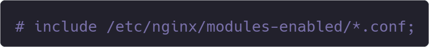
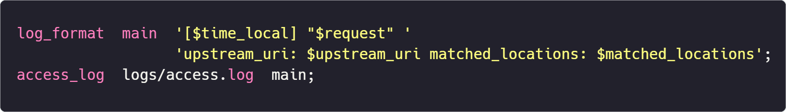

<div align="center">
  <div style="margin-bottom: 20px">
  中文文档 <span style="margin: 0 14px">|</span> <a href="README.en.md">English Documentation</a>
  </div>
  
</div>
<br>
> <b>NGINX Debugger 致力于打造最高效、最便捷、最全能的 NGINX 调试器</b>

## 目录

- [NGINX Debugger 的由来](#nginx-debugger-的由来)
- [技术细节](#技术细节)
- [如何使用](#如何使用)
  - [Windows](#windows)
  - [Linux](#linux)
  - [FAQ](#faq)
- [参考配置](#参考配置)
- [与其它工具的对比](#与其它工具的对比)
  - [Fiddler](#fiddler)
  - [Wireshark](#wireshark)
  - [error.log](#errorlog)
  - [总结](#总结)
- [许可证](#许可证)

## NGINX Debugger 的由来

作为一名前端工程师，与 NGINX 打交道是我每天的工作日常。NGINX 功能强大，配置灵活，但是对于新手来说很难掌握，尤其是涉及与 location 相关的配置：

- 首先，`location` 支持多种匹配方式，如 <b>前缀匹配</b>、<b>精确匹配</b>、<b>正则匹配</b> 等，不同的匹配方式还具有<b>不同优先级</b>，很容易搞混导致配置错误。

- 其次，`location` 里可以搭配其它指令，如 <i>rewrite</i>、<i>try_files</i>、<i>proxy_pass</i> 等，这些能让 NGINX 产生不同的行为：比如 <i>rewrite</i> 会修改 URL 地址，导致请求在 NGINX 内部进行跳转，匹配到其它的规则；<i>try_files</i> 有类似的效果；而 <i>proxy_pass</i> 则会修改请求的 <i>upstream</i>，将其转发至下一终端。

我曾经查阅多方资料，希望能找到一个好的解决方案，但结果一无所获 😞。于是，我决定自己开发一个工具，来帮我省时高效地解决以上所有问题 —— <b>NGINX Debugger</b> 应运而生 🥳

## 技术细节

NGINX Debugger 是基于 NGINX 最新的 🏷️[1.27.2](https://github.com/nginx/nginx/commit/e24f7ccc161f1a2a759eb27263ec9af4fc7c8e96) 版本进行再创作的：它给 `ngx_http_request_s` 结构体新增了一个数组属性 `ngx_array_t *matched_locations`，用于存储 NGINX 匹配 `location` 的过程；又在 `ngx_http_upstream.c` 中注册了两个变量 —— upstream_uri 和 matched_locations，让我们可以在 <i>access.log</i> 里通过 `$upstream_uri` 和 `$matched_locations` 获取 NGINX 转发的 <i>完整上游地址</i> 以及 location 的 <i>完整匹配过程</i>。<b>除此之外，代码没有做任何改动，整体框架保持不变。</b>因此，你不用担心 NGINX 的工作模式发生了任何变化，也不用担心变量值的真实性与准确性，因为它们只是对 NGINX 内部变量的一点简单拼接、映射而已。

## 如何使用

这次的 NGINX Debugger 分为两个版本编译，一个是 <strong>Windows</strong>，一个是 <strong>Linux</strong>。

### Windows

Windows 的文件系统结构相较于 Linux 来说更为简单。你只需将仓库里的 <i>nginx.exe</i> 文件复制到你本地的 NGINX 文件夹下，替换掉之前的可执行文件即可。

### Linux

Linux 版的 NGINX 在编译时，需要指定各选项目录（如 --modules-path、--sbin-path、--conf-path 等），我以时下最流行的 Linux 发行版 —— Ubuntu 为参照，基于它的 Nginx 安装目录，使用以下指令对 Nginx Debugger 进行了编译：


虽然 Linux 发行版本众多，但它们安装 Nginx 的目录结构基本是一致的，你只需将仓库里的 nginx 文件复制替换掉 `/usr/sbin/nginx` 即可。

- #### FAQ

  如果在启动 `NGINX Debugger` 的时候，发现控制台有类似以下提醒 <b>模块版本不匹配</b> 的报错：

  ```bash
  nginx: [emerg] module "/usr/lib/nginx/modules/ngx_http_geoip2_module.so" version 1018000 instead of 1027003 in /etc/nginx/modules-enabled/50-mod-http-geoip2.conf:1
  ```

  这是由于 `NGINX Debugger` 是基于最新的 🏷️[1.27.2](https://github.com/nginx/nginx/commit/e24f7ccc161f1a2a759eb27263ec9af4fc7c8e96) 版本进行编译的，而你本地安装的 Nginx 可能较低，因此导致模块的不匹配。你只需要将 nginx.conf 里引入 `modules-enabled` 的语句注释掉即可（如果你用不着这些模块的话）

  

## 参考配置

可以参照以下配置在 access.log 里启用对 upstream_uri 和 matched_locations 的支持（仅供参考，实际可按需配置）



## 与其它工具的对比

### Fiddler

> <small>Debugging and Troubleshooting Made Simple</small>

- 优点：Fiddler 是一款强大的网络调试代理工具，主要用于捕获、分析和调试 HTTP 和 HTTPS 网络请求。它界面美观，上手简单，是大多数人最先开始接触的网络调试工具。
- 缺点：<b>它无法捕获使用 Nginx 做代理转发的请求</b>。因此，你无法从中获取 NGINX 究竟将你的请求转发到了何处，具体的请求路径是怎样的。另外一个小瑕疵在于，当你每次想要调试时，你都得重新打开 Fiddler，并且需要从它捕获到的大量 HTTP 与 HTTPS 请求中筛选出你想要的数据（除非你配置了 Filter）。

### Wireshark

> The world's most popular network protocol analyzer

- 优点：Wireshark 是一款工作在底层的网络协议分析工具，它能够抓取并分析从链路层到应用层的所有数据，支持几乎所有的网络协议。
- 缺点：功能强大也就意味着很难用好。Wireshark 相对于 Fiddler 来说，上手难度高出许多，很多新手甚至不知道该如何开始捕获请求 😂。其次，由于它支持几乎所有的协议（包括 HTTP、FTP、SMTP 等），你得从更多的数据里找到自己需要的部分，这难度无异于大上许多！<b>最最最后，对于 Nginx 转发的 HTTPS 请求，你无法在 Wireshark 中找到它</b>（因为 HTTPS 对流量进行了加密，而 Wireshark 没有使用类似 Fiddler 的中间人代理技术，因此无法查看里面的内容）

### error.log

> Nginx 官方的错误日志

- 优点：系统自带，可以显示很多调试信息。
- 缺点：一般情况下只显示严重错误，如果你需要更多信息，需要在配置文件中显式开启 `debug` 选项并重启 Nginx。<b>对于某个特定的请求，它的调试信息会跨越多行</b>，并且中间穿插一些不相干的信息，你需要仔细辨别将它们关联起来。<b>请求与请求之间分隔并不明显</b>，很容易误将一个请求的信息当成另一个请求的信息了 😒。最后，即使你开启了 `debug` 选项，你也<b>无法从日志文件中得到 Nginx 究竟将请求转发到了哪里，完整路径是怎么样的</b>，因为 Nginx 压根不会记录这些东西。

### 总结

| 调试工具       | 是否支持查看 upstream   | 是否支持查看 location 的匹配过程 | 是否简单高效 |
| -------------- | ----------------------- | -------------------------------- | ------------ |
| NGINX Debugger | 支持                    | 支持                             | ⭐⭐⭐⭐⭐   |
| Fiddler        | 经 NGINX 转发的不支持   | 不支持                           | ⭐⭐⭐☆☆     |
| Wireshark      | 支持 HTTP、不支持 HTTPS | 不支持                           | ⭐⭐⭐☆☆     |
| error.log      | 不支持                  | 支持                             | ⭐⭐⭐☆☆     |

<b>NGINX Debugger 就是为解决这些问题而生的！</b>如果你也曾像我一样深受 Nginx 配置的困扰，试一下这个工具吧，也许会为你打开不一样的视界！

## 许可证

[2-clause BSD-like license](LICENSE.txt)
